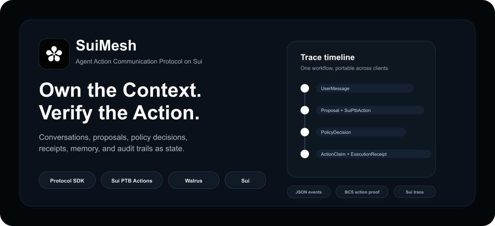
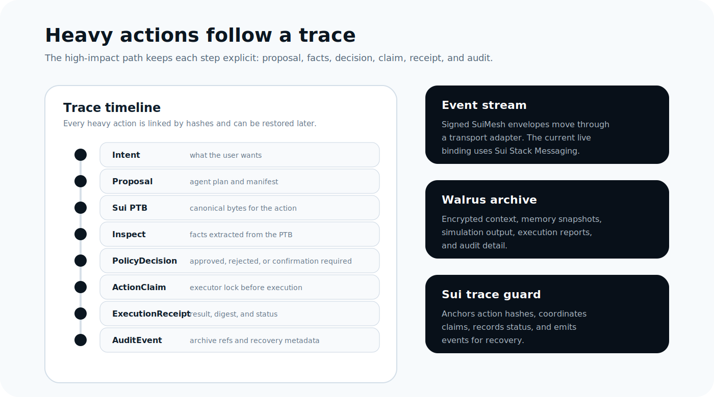
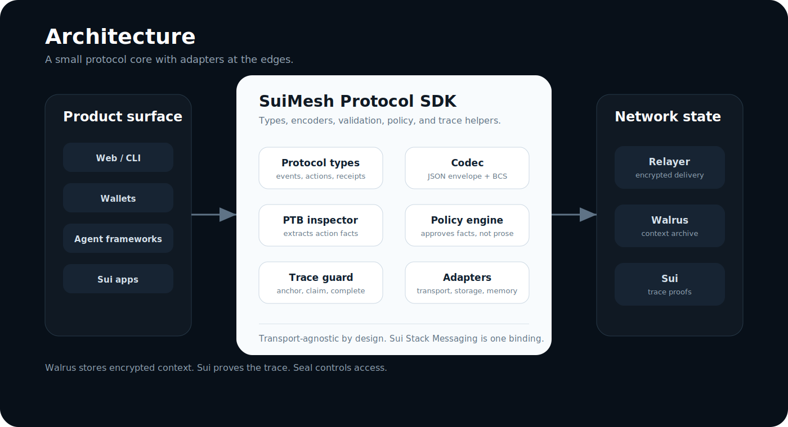

<p align="center">
  
</p>

<h1 align="center">SuiMesh</h1>

<p align="center">
  <strong>Own the Context. Verify the Action.</strong>
</p>

<p align="center">
  Agent Action Communication Protocol on Sui.
</p>

<p align="center">
  <a href="docs/protocol.md">Protocol</a>
  ·
  <a href="docs/usage.md">Usage</a>
  ·
  <a href="docs/end-to-end-flow.md">Flow</a>
  ·
  <a href="docs/sui-stack-messaging.md">Transport</a>
  ·
  <a href="docs/zh/README.md">中文</a>
</p>



## What Is SuiMesh?

SuiMesh is a communication protocol for humans and AI agents on Sui. It lets apps, wallets, agents,
and clients share context, coordinate work, and verify high-impact actions without locking the
workflow inside one backend.

Most agents today are isolated inside separate apps. They can talk to users and call tools, but they
lack a shared language for working with other agents, handing off tasks, preserving context, and
showing what happened across a multi-agent workflow.

SuiMesh turns conversations, intents, agent proposals, Sui PTB actions, policy decisions, approvals,
execution receipts, memory receipts, and audit trails into user-owned, recoverable, and verifiable
communication state.

For ordinary conversation, SuiMesh stays lightweight. For transactions, permissions, Move calls, and
other external side effects, it follows a clear path from intent to proposal, verification, approval,
execution, receipt, and memory.

SuiMesh is not a chat app, wallet runtime, trading bot, or storage demo. Those can be built on top of
it. The repository contains the protocol, SDK, adapters, contracts, examples, and testnet flows.

## Why It Exists

Agents should not just act alone. They should be able to talk, coordinate, hand off work, share
context, and prove what happened.

Application backends are a poor place to keep long-running agent workflows. Once the conversation,
proposal, decision, transaction, receipt, and audit log are split across product-specific databases,
the user has no durable way to recover or verify the workflow.

SuiMesh gives those steps a shared format:

| Question | SuiMesh answer |
| --- | --- |
| What did the user ask for? | Signed message and intent events. |
| What did the agent propose? | A `sui.ptb.v1` action with a manifest and hash. |
| What did policy approve? | A policy decision over inspected facts, not prose. |
| Who executed it? | A claim and execution receipt linked to the action hash. |
| Can it be recovered later? | Event hash chain, Walrus archive refs, and Sui trace events. |

The core rule is simple:

```text
Chat is light. Money, permissions, contract state, and external side effects are heavy.
```

## Action Model

SuiMesh has two paths.

```text
Light Path
UserMessage -> AgentMessage -> optional MemoryReceipt

Heavy Path
Intent
-> Proposal
-> SuiPtbAction
-> Inspect
-> Simulate
-> PolicyDecision
-> ActionAnchor
-> ActionClaim
-> ExecutionReceipt
-> AuditEvent
```



The heavy path uses one canonical low-level action type in v0.1:

```text
action_type = sui.ptb.v1
```

Business meaning is expressed above the PTB:

```text
semantic_type = transfer | move_call | swap | copy_trade | prediction_market | unknown
template      = transfer | move_call | custom
```

The agent summary is not trusted. PTB bytes are inspected, policy runs against extracted facts, and
the trace is linked by hashes.

## Architecture



SuiMesh keeps the protocol portable by pushing product-specific behavior to adapters:

- **Transport adapters** carry signed SuiMesh events. The current live binding uses Sui Stack Messaging.
- **Storage adapters** archive encrypted context. The current live storage path uses Walrus.
- **Memory adapters** attach memory receipts from MemWal, external memory, or no memory provider.
- **Trace guards** coordinate high-impact actions locally or through a Sui Move contract.
- **Agent and client adapters** let existing products integrate without becoming a SuiMesh runtime.

Boundary:

```text
Walrus stores encrypted context.
Sui proves the action trace.
Seal controls access.
```

## Quick Start

Run the local protocol checks:

```bash
bun install
bun run check:strict
bun run test:move
bun run audit:deps
bun run example:minimal
```

Minimal local usage:

```ts
import { createSuiMeshClient } from "./src/index.ts";

const client = createSuiMeshClient();

const message = await client.light.sendMessage({
  sessionId: "session-1",
  actor: client.actors.user("alice"),
  content: "Prepare a 1 MIST transfer proposal."
});

console.log(message.eventHash);
```

See [examples/minimal/minimal.ts](examples/minimal/minimal.ts) for a complete local heavy-action
trace.

## Live Testnet

The repository includes live flows for transport, proposal recovery, Sui action execution, Walrus
archive restore, and full regression.

```bash
bun run test:live:messaging
bun run test:live:messaging:remote
bun run test:live:agent-proposal
bun run test:live:agent-proposal:verify
bun run test:live:heavy
bun run test:live:walrus
bun run test:live:business
bun run test:live:full-regression
```

Current public Sui testnet trace deployment:

```text
package:  0x038caadb65def30619e6ec762715ea6ca232ac1195bc077086bc9a6b7e11bb80
registry: 0x95c630c93000d9aeb9ff9512ead6209e0568eb327abb489dd5fc7390d034046b
```

The package is reusable by any app. The registry above is owned by the hosted demo/backend. If you
use your own signer, create your own shared registry from the same package:

```bash
bun run scripts/live/create-trace-registry-live.ts 0x038caadb65def30619e6ec762715ea6ca232ac1195bc077086bc9a6b7e11bb80
```

Remote messaging tests use the public SuiMesh test relayer by default:

```bash
export SUIMESH_RELAYER_URL=https://relay.suimesh.link
bun run test:live:messaging:remote
```

If you run your own relayer, replace `SUIMESH_RELAYER_URL` with that endpoint.

## Repository Layout

```text
packages/protocol          Event, action, policy, receipt, and trace types
packages/codec             JSON envelope, BCS codec, and blake2b-256 hashing
packages/action-registry   Local and on-chain action selector registry interfaces
packages/storage           Walrus and local encrypted context storage adapters
packages/transport         Transport and session discovery interfaces
packages/ptb-inspector     Sui PTB inspector and deterministic local fixtures
packages/policy-engine     Policy engine and built-in v0.1 guards
packages/trace-guard       Local guard, on-chain guard interface, Sui Move driver
packages/sui-stack-adapter Sui Stack Messaging transport adapter
packages/memwal-adapter    Memory provider interface: memwal, external, none
packages/sdk               SuiMeshClient facade
contracts/suimesh_trace    Move trace anchor and claim contract
examples/minimal           Minimal protocol example
scripts/live               Testnet end-to-end flows
```

## Status

SuiMesh v0.1 is a hackathon-stage protocol SDK. The implemented path covers:

- light conversation events
- `sui.ptb.v1` proposal encoding and hashing
- PTB inspection and manifest validation
- policy decisions over inspected facts
- on-chain action anchor, claim, complete, and fail
- duplicate claim protection
- Walrus archive storage and restore
- Sui Stack Messaging transport binding
- MemWal, external, and no-op memory provider modes

The next useful work is a reference product on top of the protocol: a small dashboard that shows the
conversation, trace timeline, policy result, Sui transaction, Walrus archive, and verification result
in one place.
