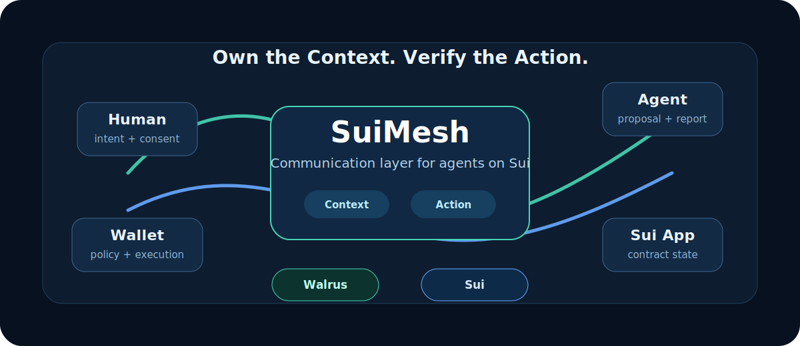

# SuiMesh



**Own the Context. Verify the Action.**

SuiMesh is a communication layer for humans and AI agents on Sui. It turns conversations, intents, agent proposals, Sui PTB actions, policy decisions, execution receipts, and audit trails into user-owned, recoverable, and verifiable communication state.

SuiMesh is not a chat app, an agent wallet, or a trading bot. It is the protocol layer that lets apps, wallets, agents, and clients share the same trusted context without locking it inside one backend.

## The Short Version

SuiMesh answers three questions for agentic apps:

- What did the user ask the agent to do?
- What action did the agent actually propose?
- Who approved, claimed, executed, and recorded the result?

For ordinary chat, SuiMesh stays lightweight. For transfers, contract calls, trading, permissions, and other external side effects, it creates a verifiable action trace.

## What Problem It Solves

AI agents are starting to talk to users, prepare transactions, call contracts, place trades, and coordinate with other services. Today, most of that interaction lives inside one app database or one agent backend.

That creates three problems:

- Context is locked in one product. A user cannot easily recover the same conversation, memory, task history, or audit trail from another client.
- Agent actions are hard to verify. A nice summary is not enough when money, permissions, or contract state are involved.
- Execution history is fragmented. The message, the proposal, the policy decision, the on-chain transaction, and the final report are often stored in different places.

SuiMesh gives these interactions a shared communication state.

## How SuiMesh Works

SuiMesh separates normal conversation from high-stakes actions.

**Light Path** is for chat and context:

```text
UserMessage -> AgentMessage -> optional MemoryReceipt
```

**Heavy Path** is for money, permissions, contract state, trading, copy-trading, prediction markets, and other external side effects:

```text
Intent -> Proposal -> SuiPtbAction -> Inspect -> Simulate -> PolicyDecision -> ActionClaim -> ExecutionReceipt -> AuditEvent
```

Rule:

```text
Chat is light. Money, permissions, contract state, and external side effects are heavy.
```


## A Simple Scenario

Alice asks an agent to prepare a Sui transfer.

The agent can still chat normally, but when money is involved it must produce a structured proposal. SuiMesh inspects the real PTB, checks the proposal against policy, records the decision, lets an authorized executor claim the action, and stores the final receipt and audit trail.

Later, Alice can recover the same context from another client. She does not need to trust one chat app or one agent backend to remember what happened.

## Architecture


SuiMesh keeps the protocol portable by making integrations pluggable:

- Client adapters can connect web apps, CLI tools, Telegram or Discord bridges, wallets, and Sui apps.
- Agent adapters let existing agent frameworks publish proposals and reports without becoming a SuiMesh runtime.
- Transport adapters carry signed SuiMesh events. The current implementation includes a Sui Stack Messaging adapter.
- Storage adapters archive encrypted context. The current live flow uses Walrus.
- Trace guards coordinate high-stakes actions. The current implementation includes a local guard and a Sui Move guard.

The boundary is simple:

```text
Walrus stores the context.
Sui proves the trace.
Seal controls access.
```

## Why It Matters

With SuiMesh, a user can start in one client, let an agent produce a proposal, have a policy engine evaluate the real PTB, execute through an authorized executor, and later recover the same verified trace from another client.

The important rule is:

```text
Agent summary is untrusted.
PTB bytes are the source of truth.
Manifest must match inspected PTB facts.
Policy approves facts, not prose.
```

This makes agent communication useful for workflows where auditability matters: transfers, contract calls, copy trading, escrow, prediction markets, DAO operations, and other Sui application flows.

## What It Does Today

SuiMesh v0.1 includes:

- Send and verify light conversation events.
- Turn high-stakes agent proposals into inspectable Sui PTB actions.
- Compare the proposal manifest with the real PTB facts.
- Evaluate policy before execution instead of relying on manual approval.
- Anchor, claim, complete, or fail actions through a Sui Move trace guard.
- Archive encrypted context on Walrus and restore it later.
- Carry events through a pluggable transport adapter, including Sui Stack Messaging.
- Attach memory receipts from MemWal, external memory, or no memory provider.
- Run local examples, unit tests, Move checks, and live testnet regression flows.

## Quick Start

```bash
bun install
bun run check:strict
bun run test:move
bun run audit:deps
bun run example:minimal
```

## Minimal Example

```ts
import { createSuiMeshClient } from "./src/index.ts";

const client = createSuiMeshClient();

const message = await client.light.sendMessage({
  sessionId: "session-1",
  actor: client.actors.user("alice"),
  content: "Prepare a 1 MIST transfer proposal."
});

console.log(message.eventHash);
```

See [examples/minimal/minimal.ts](examples/minimal/minimal.ts) for a complete local heavy-action trace.

## Live Testnet Flows

The repository includes live flows for the full protocol story:

```bash
bun run test:live:messaging
bun run test:live:messaging:remote
bun run test:live:agent-proposal
bun run test:live:agent-proposal:verify
bun run test:live:heavy
bun run test:live:walrus
bun run test:live:business
bun run test:live:full-regression
```

The full regression covers typecheck, unit tests, remote messaging, agent proposal verification, on-chain heavy action execution, Walrus archive restore, and the integrated business flow.

## Repository Map

```text
packages/protocol          Event, action, policy, receipt, trace types
packages/codec             JSON envelope, BCS codec, blake2b-256 hashing
packages/action-registry   Local and on-chain action selector registry interfaces
packages/storage           Walrus and local encrypted context storage adapters
packages/transport         Transport and session discovery interfaces
packages/ptb-inspector     Sui PTB inspector and deterministic local fixtures
packages/policy-engine     Policy engine and built-in v0.1 guards
packages/trace-guard       Local guard, on-chain guard interface, Sui Move driver
packages/sui-stack-adapter Sui Stack Messaging transport adapter
packages/memwal-adapter    Memory provider interface: memwal, external, none
packages/sdk               SuiMeshClient facade
contracts/suimesh_trace    Move trace anchor and claim contract
examples/minimal           Minimal protocol example
scripts/live               Testnet end-to-end flows
```

## Documentation

- [Protocol specification](docs/protocol.md)
- [Usage guide](docs/usage.md)
- [End-to-end flow](docs/end-to-end-flow.md)
- [Transport adapter guide](docs/sui-stack-messaging.md)
- [Chinese documentation](docs/zh/README.md)

## Status

SuiMesh v0.1 is a hackathon-stage protocol SDK. The core path is implemented and tested locally, with live testnet flows for transport, agent proposal verification, Sui action execution, Walrus archive restore, and business end-to-end recovery.

The next useful improvements are Move unit tests, richer policy templates, more agent framework adapters, and a richer demo experience.
